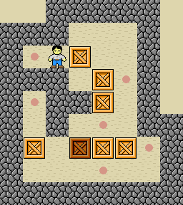
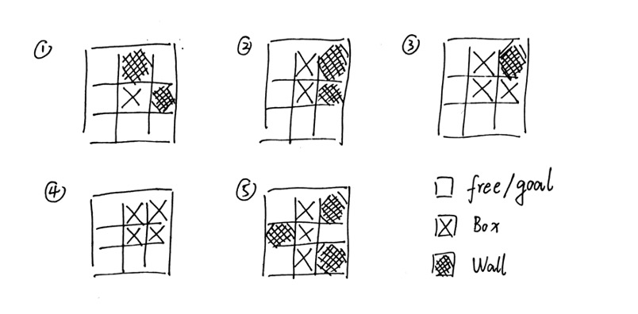

ตัวแก้เกม sokoban
=============================
โครงการนี้เสนอตัวแก้ปัญหา AI สำหรับ sokoban (ภาษาญี่ปุ่นสำหรับผู้ดูแลคลังสินค้า) ซึ่งเป็นปัญหาการคำนวณที่ยาก อัลกอริทึมที่ใช้ประกอบด้วย BFS (การค้นหาแบบกว้างๆ) DFS (การค้นหาเชิงลึกก่อน) UCS (การค้นหาต้นทุนสม่ำเสมอ) และ A* (ค้นหาดาว).

## สารบัญ

* [0. วิธีใช้งาน](#0)
* [1. ภาพรวม](#1)
* [2. การเปรียบเทียบผลลัพธ์](#2)

<a id="0"></a>
## 0. วิธีใช้งาน

1. ไลบรารีที่ต้องนำเข้าคือ: 'sys', 'collections', 'numpy', 'heapq', 'time'

2. หลังจากดาวน์โหลดในเครื่องแล้ว ให้เรียกใช้ไฟล์ `sokoban.py`

### ดูความช่วยเหลือ

```
$ python sokoban.py --help
```
```
การใช้: sokoban.py [ตัวเลือก]

ตัวเลือก:
  -h, --help แสดงข้อความช่วยเหลือนี้และออก
  -l SOKOBANLEVELS, --level=SOKOBANLEVELS
                        ระดับของเกมที่จะเล่น (test1-10.txt, level1-5.txt)
  -m AGENTMETHOD, --method=AGENTMETHOD
                        วิธีการวิจัย (bfs, dfs, ucs, astar)
```

`-l`: แผนที่แบ่งออกเป็นการทดสอบและระดับ การทดสอบค่อนข้างง่าย และระดับที่ยากขึ้น
`-m`: อัลกอริทึมการค้นหาคือ bfs, dfs, ucs หรือ astar

### เรียกใช้ตัวอย่าง

```
$ python sokoban.py -l test1.txt -m bfs
```
```
rUUdRdrUUluL
รันไทม์ของ bfs: 0.15 วินาที
```
ผลลัพธ์ของบรรทัดแรกคือการกระทำของผู้กด `u` `d` `l` `r` แทนการเคลื่อนที่ขึ้น ลง ซ้ายและขวาตามลำดับ และตัวพิมพ์ใหญ่ที่เกี่ยวข้องแสดงถึงการผลักกล่อง ไปในทิศทางนี้ บรรทัดที่สองแสดงเวลาทำงานของโปรแกรม

<a id="1"></a>
## 1. ภาพรวม

Sokoban หรือที่รู้จักในชื่อเกม Sokoban [Game Link](https://www.mathsisfun.com/games/sokoban.html) ผู้เล่นต้องผลักกล่องทั้งหมดไปยังจุดหมายปลายทางเพื่อประสบความสำเร็จ

### ตัวอย่างแผนที่ (`level1.txt`)

**รูปแบบภาพ:**



**แบบฟอร์มการป้อนข้อมูล:**

```
  #####
### #
#.&บี #
###บ.#
#.##บี #
# # . ##
#บีเอ็กซ์บีบี#
# . #
##########
```

โดยที่ `#` คือกำแพง `.` คือปลายทาง `B` คือกล่อง (`X` คือกล่องที่ปลายทาง) `&` คือคนที่ผลักกล่อง (`%` คือกล่องบน ปลายทาง) ช่องว่างคือพื้นที่ที่สามารถเคลื่อนย้ายได้

### ไอเดีย

ความเข้าใจง่ายๆ เกี่ยวกับการใช้อัลกอริธึมการค้นหาในที่นี้คือ ในสถานะปัจจุบัน ตัวผลักจะดำเนินการที่เป็นไปได้เพื่อสร้างสถานะถัดไป และอื่นๆ จนกว่าสถานะสุดท้ายจะเป็นสถานะสิ้นสุด เนื่องจากมีการใช้อัลกอริธึมการค้นหา สิ่งแรกที่ต้องกำหนดคือกราฟพื้นที่สถานะ (SSG) และแผนผังการค้นหา (ST) หากแมปอินพุตทั้งหมดถูกจัดเก็บโดยตรงเป็น SSG ในโครงสร้างข้อมูล การใช้หน่วยความจำจะเพิ่มขึ้นเมื่อการค้นหาดำเนินไป ดังนั้น SSG ใหม่จึงต้องกำหนดขึ้นใหม่ ซึ่งไม่เพียงช่วยลดการยึดครองพื้นที่ แต่ยังแสดงข้อมูลที่เพียงพออีกด้วย ในปัญหาของ sokoban ส่วนสำคัญเป็นเพียงตำแหน่งของกล่องและตำแหน่งของบุคคล เพราะตำแหน่งของกำแพงและปลายทางเหมือนกัน ดังนั้น รูปแบบของการกำหนด SSG จึงเป็นดังนี้ โดยที่ทูเพิลแรกแทนพิกัดของบุคคลปัจจุบัน และทูเพิลที่สองแทนพิกัดของกล่องปัจจุบัน

```
((2, 2), ((2, 3), (3, 4), (4, 4), (6, 1), (6, 4), (6, 5)))
```

ST เป็นการแตกแขนงของ SSG ปัจจุบันตามการกระทำที่เป็นไปได้ของ pusher การดำเนินการแต่ละครั้งจะนำไปสู่การสร้าง SSG ใหม่และแตกต่างกัน และในที่สุดจะมีการสร้างกิ่งและโหนดจำนวนมากขึ้น ตราบใดที่พิกัดของกล่องทั้งหมดและพิกัดของปลายทางตรงกันทุกประการ เกมก็จะจบลง (ชัยชนะ) แต่ในเกม sokoban กล่องมักจะถูกผลักไปยังตำแหน่งบางอย่าง เช่น ทางตัน สถานการณ์นี้จะนำไปสู่การสิ้นสุดของเกม (ล้มเหลว) จริง ๆ ดังนั้นจึงไม่จำเป็นต้องดำเนินการต่อ ดังนั้น การใช้รูปแบบเหล่านี้ที่นำไปสู่ทางตันสามารถช่วยเราตัดต้นไม้ได้ ดังนั้นจำนวนโหนดที่แยกออกจึงลดลงอย่างมาก ซึ่งจะช่วยลดรอยเท้าของหน่วยความจำ รูปต่อไปนี้แสดงรูปแบบตายตัว โดยมีกล่องอยู่ตรงกลาง หากสถานการณ์เหล่านี้ปรากฏในวงกลมรอบข้างแสดงว่าสถานะปัจจุบันไม่จำเป็นต้องแยกจากกันอีกต่อไป



นอกจากนี้ เพื่อป้องกันไม่ให้ผู้ผลักทำการเคลื่อนไหวที่ไร้ความหมาย เช่น การโยกไปมาโดยไม่กดกล่อง เราจำเป็นต้องสร้าง SSG หลังจากที่แต่ละสาขาไม่ทำซ้ำ SSG บนกิ่งเดียวกัน นั่นคือ ตำแหน่งของ a ไม่สามารถทำซ้ำ "บุคคลและทุกช่อง" "ตำแหน่ง" ได้

จากนั้นมีส่วนหนึ่งของอัลกอริธึม BFS และ DFS จะไม่พูดอะไรมาก หนึ่งคือ "ก้าวเล็ก ๆ สำหรับแต่ละถนนและเดินช้าๆ" และอีกทางหนึ่งคือ "ถนนสายหนึ่งไปสู่ความตายแล้วต่อไป" ฟังก์ชันต้นทุนถูกเพิ่มใน UCS ซึ่งก็คือ "ใช้วิธีที่คุ้มค่าที่สุด" ฟังก์ชันต้นทุนในที่นี้ถูกกำหนดเป็น: จำนวนขั้นตอนที่ดำเนินการโดยไม่ทำให้กล่องอยู่ในสถานะปัจจุบัน สิ่งนี้จูงใจให้ผู้ผลักทำการเคลื่อนไหวที่มีความหมายให้มากที่สุด แทนที่จะเดินไปรอบๆ โดยไม่กดกล่อง สุดท้าย A* การเพิ่มฟังก์ชันฮิวริสติกให้กับฟังก์ชันต้นทุน จุดประสงค์คือเพื่อกระตุ้นให้ผู้ผลักไม่เพียงแต่ผลักกล่อง แต่ยังเพื่อผลักกล่องไปยังปลายทางด้วย ฟังก์ชันฮิวริสติกในที่นี้ใช้ระยะห่างแบบแมนแฮตเทน ซึ่งหมายถึงผลรวมของระยะทางแบบแมนแฮตเทนระหว่างตำแหน่งลำดับของกล่องทั้งหมดและตำแหน่งลำดับของปลายทางทั้งหมดจนถึงสถานะปัจจุบัน

<a id="2"></a>
## 2. การเปรียบเทียบผลลัพธ์

*บีเอฟเอส:

```
$ python sokoban.py -l test1.txt -m bfs
rUUdRdrUUluL
รันไทม์ของ bfs: 0.15 วินาที

$ python sokoban.py -l test1.txt -m bfs
rUUdRdrUUluL
รันไทม์ของ bfs: 0.13 วินาที

$ python sokoban.py -l test2.txt -m bfs
UddrrrUUUUUUUUUUUUUUUUUUUUUUUUUUUUUUUUUUUUUUUUUUUUUUUUUUU
รันไทม์ของ bfs: 0.01 วินาที

$ python sokoban.py -l test3.txt -m bfs
LrdrddDLdllUUdR
รันไทม์ของ bfs: 0.27 วินาที

$ python sokoban.py -l test4.txt -m bfs
llldRRR
รันไทม์ของ bfs: 0.01 วินาที

test5.txt: มากกว่า 1 นาที

$ python sokoban.py -l test6.txt -m bfs
dlluRdrUUUddrruuulL
รันไทม์ของ bfs: 0.02 วินาที

$ python sokoban.py -l test7.txt -m bfs
LUUUluRddddLdlUUUUluR
รันไทม์ของ bfs: 1.25 วินาที

$ python sokoban.py -l test8.txt -m bfs
llDDDDDDldddrruuLuuuuuurrdLulDDDDDDlllddrrUdlluurRdddrruuLUUUUUUluRddddddddrddlluUdlluurRdrUUUUUU
รันไทม์ของ bfs: 0.30 วินาที

$ python sokoban.py -l level1.txt -m bfs
RurrddddlDRuuuuLLLrdRDrddlLdllUUdR
รันไทม์ของ bfs: 35.04 วินาที
```

*ดีเอฟเอส:

```
$ python sokoban.py -l test1.txt -m dfs
rrUrdllluRRlldrrrUlllururrDLrullldRldrrUruLrdllldrrdrUlllurrurDluLrrdllldrrdrUU
รันไทม์ของ dfs: 0.09 วินาที

$ python sokoban.py -l test2.txt -m dfs
รรรรรรรรรรรรรรรรรรรรรรรรรรรรรรรรรรร
รันไทม์ของ dfs: 0.01 วินาที

$ python sokoban.py -l test3.txt -m dfs
rrdldrdllDRlldlUrrrdrruLrdllLrrrululldRllldRlurrrdrruLrdllUrrdllLrrrullllldRRRlllurrrrrdLrulllllUdrrrrrdlLrrullllldrRRlllurrrrrdLrullluRldrrrdlLrrullllldrRRlllurrrrrdLrulllururulluLrrrdlddldrrrdlLrrullllldrRRlllurrrrrdLrulUlldrrrdlLrrullllldrRRlllurrrrrdLrulllurrUldrdrdlLrrullllldrRRlllurrrrrdLrulllurrululurrDDldldrrrdlLrrulllururDlldrdrruLrdllLrrrululldRllldRlurrrdLrrruLrdlllulldRRRlllurrurrdrdLrulL
รันไทม์ของ dfs: 0.36 วินาที

$ python sokoban.py -l test4.txt -m dfs
กรี้สสสสสสสสสสสสสสส
รันไทม์ของ dfs: 0.01 วินาที

test5.txt: มากกว่า 1 นาที

$ python sokoban.py -l test6.txt -m dfs
กรี๊สสสสสสสสสสสสสสสสสสสสสส
รันไทม์ของ dfs: 0.02 วินาที

$ python sokoban.py -l test7.txt -m dfs
rdllllurRlldrrrruulLrrdLrdllllurRlldrrrruullLrrrdLrdllllurRlldrrrruulluulldDrrrrdLrdllllUrdrrrulLrrdlllluUrrrrdllLrrrullllUdrrrrdllldlUrrrrulluululldRRllurrrrrdddllldrrrdlllluUrrrruuullllldrDDrrrrdllldlUrrrrulluUlllurrRllldrrrddrrdllllUrrrruuuLrdddllllUdrruuluRllldRRllurrrDllddrrrruuuLrdddlllluurrDDrrdlLrrdlllluRRlldrrrruulllluuruRllldrrrddrrdLrdllllurRlldrrrruuuuuLrdddlllldrrdrUrdllllurrulluuruRllldrrrddlldrrrruLrdllllurRlldrrrruuuuLrdddLrdlllluuuruRllldrrrdDrruuuLrdddlllluu
ruRllldrrrddrrdlLrrdlllluurrrruuLrdddllllddrrrrullLrrrdllllUrrrrulluulDrrdddlllluulRRllldrrddrrdllldlUrrruuuLrdddllldrrrdllllluUrrrruuulLrrdddllulllullRRllldrrddrrrllluUdrrrruuUlldruRldrlu
เวลารันไทม์ของ dfs: 0.78 วินาที

$ หลาม sokoban.py -l test8.txt -m dfs
llDlurrrdLrullldRDDDDDlllddrrdrruuLrddllulluurrruuuuulurrrdLrullldRdddddlllddrrUruLruuuuulurrrdLrullDDDDDDlddlluuRRllddrrdrruuLrddllulluurrDrUldrrddllUlluurrrUdlllddrrUruLruUddldrrddllulluuRlddrrdrruuluLruuUdddldrrddllulluuRlddrrdrruuluLruuuUddddldrrddllulluuRlddrrdrruuluLruuuuUluRldrdddddldrrddllulluuRRllddrrdrruulUUUUUU
เวลารันไทม์ของ dfs: 0.11 วินาที

level1.txt: มากกว่า 1 นาที
```

* ยูซีเอส:

```
$ หลาม sokoban.py -l test1.txt -m ucs
rURdrUUlLdlU
เวลารันไทม์ของ ucs: 0.09 วินาที

$ หลาม sokoban.py -l test2.txt -m ucs
UUdrrrrUU
เวลารันไทม์ของ ucs: 0.01 วินาที

$ หลาม sokoban.py -l test3.txt -m ucs
LrdrddDLdllUUdR
เวลารันไทม์ของ ucs: 0.17 วินาที

$ หลาม sokoban.py -l test4.txt -m ucs
llldRRR
เวลารันไทม์ของ ucs: 0.01 วินาที

test5.txt: มากกว่า 1 นาที

$ หลาม sokoban.py -l test6.txt -m ucs
dlluRdrUUUddrruuulL
เวลารันไทม์ของ ucs: 0.02 วินาที

$ หลาม sokoban.py -l test7.txt -m ucs
LUUUluRddddLdlUUUUluR
เวลารันไทม์ของ ucs: 0.94 วินาที

$ หลาม sokoban.py -l test8.txt -m ucs
llDDDDDDldddrruuลูลูฮูลูลูDDDDDDlllddrrUdlluurRdddrruuLUUUUUUลูRddddddrdlluUdlluurRdrUUUUUU
เวลารันไทม์ของ ucs: 0.31 วินาที

$ หลาม sokoban.py -l level1.txt -m ucs
RurrddddlDRuuuuLLLrdRDrddlLdllUUdR
เวลารันไทม์ของ ucs: 33.22 วินาที
```

*ดวงดาว

```
$ หลาม sokoban.py -l test1.txt -m astar
rUUdRdrUUluL
รันไทม์ของดาวฤกษ์: 0.01 วินาที

$ หลาม sokoban.py -l test2.txt -m astar
UUdrrrrUU
รันไทม์ของดาวฤกษ์: 0.01 วินาที

$ หลาม sokoban.py -l test3.txt -m astar
LrdrddDLdllUUdR
รันไทม์ของดาวฤกษ์: 0.01 วินาที

$ หลาม sokoban.py -l test4.txt -m astar
llldRRR
รันไทม์ของ astar: 0.00 วินาที

$ หลาม sokoban.py -l test5.txt -m astar
uruLdlUURUdRdrUUllLdlU
รันไทม์ของ astar: 0.11 วินาที

$ หลาม sokoban.py -l test6.txt -m astar
dlluRdrUUUddrruuulL
รันไทม์ของ astar: 0.02 วินาที

$ หลาม sokoban.py -l test7.txt -m astar
LUUUluRddddLdlUUUUluR
รันไทม์ของ astar: 0.16 วินาที

$ หลาม sokoban.py -l test8.txt -m astar
llDDDDDDldddrruuลูลูฮูลูลูDDDDDDlllddrrUdlluurRdddrruuLUUUUUUลูRddddddrdlluUdlluurRdrUUUUUU
รันไทม์ของดาวฤกษ์: 0.33 วินาที

$ python sokoban.py -l level1.txt -m astar
RurrdLLLrrrdddlDRlLdllUUdRRurruuulldRDrddL
รันไทม์ของ astar: 0.85 วินาที
```

นักแสดงที่ดีที่สุดคือ A* ตัวดันกล่องเอาต์พุต BFS, UCS และ A* เคลื่อนที่ในลักษณะเดียวกัน แม้ว่า DFS จะสามารถหาทางออกได้เช่นกัน แต่ปรากฏการณ์นี้จะเกิดขึ้น แน่นอน วิธีอื่นๆ จะทำให้ผลลัพธ์ง่ายขึ้น ด้านที่สามารถปรับปรุงได้ในอนาคต ได้แก่ :

* กำหนด SSG ที่ง่ายกว่า
* รูปแบบตายที่ครอบคลุมมากขึ้น
* ฟังก์ชันต้นทุนและฟังก์ชันฮิวริสติกที่เหมาะสมกว่า